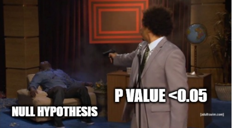

# Testování hypotéz

Hypotézou obecně myslíme nějaké tvrzení. Testování hypotéz se zabývá ověřením, zda je nějaká hypotéza platná. Při testování hypotéz předpokládáme, že máme k dispozici nějaký vzorek dat, nikoli kompletní data. To vnáší prvek určité nejistoty.

Vraťme se k prvnímu příkladu - srovnávní voleb a předvolebního průzkumu. Uvažujme tvrzení, že má různou podporu voličů v Praze než v Brně. Pokud se díváme na skutečný výsledek voleb, jasně vidíme, kolik strana ve volbách získala v obou městech. Pokud provádíme předvolební průzkum, pracujeme s nějakým vzorkem (výběrem) z populace, který má např. 500 lidí v obou městech. To přináší do našeho zkoumání nejistotu. Může se například stát, že jsme (čistě náhodou) do našeho průzkumu v jednom městě vybrali lidi, kteří mají danou stranu více rádi, než zbytek města.

Uvažujme například následující výsledky:

- V Praze podporuje danou stranu 40 % lidí a v Brně pouze 5 %. V takovém případě bychom se asi intuitivně shodli, že podpora v Praze je vyšší.
- V Praze podporuje danou stranu 10 % lidí a v Brně 50 %. V takovém případě bychom se asi intuitivně shodli, že podpora v Brně je vyšší.
- V Praze podporuje danou stranu 26 % lidí a v Brně 25 %. Zde už výsledek není jednoznačně, protože rozdíl je opravdu malý. Znamená 1 procentní bod rozdílu v našem průzkumu opravdu, že se podpora voličů liší? Co když se nám pouze náhodou do našeho vzorku v Praze dostalo více podporovatelů dané strany.

Právě na posledním příkladě se ukazuje, proč je testování hypotéz užitečné. Nedokáže sice jednoznačně říct, zda je hypotéza pravdivá, může nám ale říct, s jakou pravděpodobností je pravdivá nebo s jako pravděpodobností se mýlíme.

Vrátíme-li se k našemu souboru o cenách domů. Náš datový soubor určitě neobsahuje informace o všech domech v USA, ale pouze o některých, tj. o nějakém výběru domů. Pokud bychom tedy chtěli ověřit nějaká tvrzení o všech domech, opět se dostaneme do roviny testování hypotéz.

- Domy s bazénem jsou v průměru dražší než domy bez bazénu.
- Cena domu je ovlivněna jeho obytnou plochou.
- Ceny domu ve středně hustě zalidněných oblastech jsou méně různorodé než ceny domů ve velmi hustě zalidněných oblastech.
- Průměrná cena pozemků je různá pro různé typy umístění pozemku v zástavbě.

Testování hypotéz má pevný postup, který se skládá z následujících kroků:

* Formulace statistických hypotéz.
* Výběr vhodného testu.
* Výpočet hodnoty testového kritéria.
* Rozhodnutí o platnosti nulové hypotézy.

## Formulace statistických hypotéz

Při testování hypotéz vždy nejprve definujeme dvě hypotézy - **nulovou** a **alternativní**. Tyto dvě hypotézy musí být vždy ve sporu, tj. nemůže nastat situace, že by byly obě pravdivé. Nulová hypotéza v sobě má často znaménko *rovná se*, alternativní pak mívá znaménko *nerovná se*, *větší než* nebo *menší než*. Dále můžeme v nulové hypotéze tvrdit, že mezi dvěma sloupci v tabulce není závislost, a alternativní hypotéza bude říkat, že závislost existuje.

Navažme na předchozí lekci, kde jsme měřili sílu statistické závislosti mezi cenou domu a obytnou plochou. Hodnotu korelačního koeficientu sice známe, ale ta nám toho sama o sobě tolik neřekne. Nyní budeme chtít ověřit, že je vliv velikosti obytné plochy na cenu domu **statisticky významný**, tj. rozhodneme, zda tento vliv není čistě náhodný. 

Uvažujme následující dvojici hypotéz:

- Nulová hypotéza: Obytná plocha domu a jeho cena jsou lineárně nezávislé.
- Alternativní hypotéza: Obytná plocha domu a jeho cena jsou lineárně závislé.

Je zřejmé, že obě hypotézy nemohou být pravidivé.

Poněkud nepříjemnou zprávou pro vás může být informace, že výsledek našeho testu může být chybný, a to i v případě, že jsme postuovali správně. Může se totiž stát, že prostě máme smůlu na náš vzorek, který nereprezentuje data úplně správně.

Při testování se můžeme dopustit 2 chyb, které jsou popsány v tabulce níže.

<table>
    <tr>
        <th></th>
        <th>Nulová hypotéze platí</th>
        <th>Nulová hypotéza neplatí</th>
    </tr>
    <tr>
        <td><b>Nezamítáme nulovou hypotézu</b></td>
        <td>Správný výsledek</td>
        <td>Chyba II. druhu</td>
    </tr>
    <tr>
        <td><b>Zamítáme nulovou hypotézu</b></td>
        <td>Chyba I. druhu</td>
        <td>Správný výsledek</td>
    </tr>
</table>

Při testování hypotéz si zpravidla vybíráme pravděpodobnost, s jakou se chceme dopustit chyby I. druhu. Pravděpodobnost chyby I. druhu označujeme jako **hladinu významnosti**.

## Výběr vhodného testu

Dále zvolíme vhodný test pro ověření naší hypotézy.
Statistických testů existuje obrovské množství a výběr toho správného závisí obecně na několika faktech:

- Počet souborů (skupin) dat, se kterými chceme v testu pracovat. V tomto konkrétním případě chceme pracovat se dvěma soubory, můžeme mít ale pouze jeden či naopak 3 a více.
- Statistický ukazatel nebo skutečnost, kterou chceme ověřit. Může to být například průměr, rozptyl nebo (jak je tomu v našem případě) statistická závislost.
- Předpoklady testu. Předpoklad je nějaká podmínka, která musí být splněna, aby test dával kvalitní výsledky. Mnoho testů má předpoklad statistického rozdělení dat. Často testy rozdělujeme na parametrické a neparametrické, kde neparametrické testy jsou testy s mírnějšími předpoklady.

Vraťme se k výběru korelačního koeficientu. Pandas ve výchozím nastavení používá tzv. Pearsonův korelační koeficient. Pokud bychom s jeho pomocí chtěli ověřit, zda je vliv jedné veličiny na druhou statisticky významný, je potřeba pamatovat na to, že test hypotézy o závislosti za pomocí Pearsonova korelačního koeficientu **předpokládá, že data mají normální rozdělení** (normalitu dat).

Pokud si nejsme jisti, zda je tento předpoklad splněn, můžeme opět použít testování hypotéz.

<table>
    <tr>
        <th>Počet datových souborů</th>
        <th>Testovaný ukazatel</th>
        <th>Předpoklady</th>
        <th>Příklad výzkumné otázky</th>
        <th>Vhodný test</th>
    </tr>
    <tr>
        <td>1</td>
        <td>průměr</td>
        <td>normální rozdělení</td>
        <td>průměrná výška mužů na univerzitě je méně než 180 cm</td>
        <td>t-test</td>
    </tr>
    <tr>
        <td></td>
        <td>rozdělení dat</td>
        <td></td>
        <td>ceny domů mají normální rozdělení</td>
        <td>Shapiro-Wilk test</td>
    </tr>
    <tr>
        <td>2</td>
        <td>průměr</td>
        <td>párová pozorování</td>
        <td>výkonnost pracovníků po školení se zvýšila</td>
        <td>párový t-test</td>
    </tr>
    <tr>
        <td></td>
        <td></td>
        <td>normální rozdělení</td>
        <td>výkonnost pracovníků v dílně A je vyšší než v dílně B</td>
        <td>t-test (záleží na tom, zda mají data stejný rozptyl)</td>
    </tr>
    <tr>
        <td></td>
        <td></td>
        <td>neparametrický test</td>
        <td>voliči vládních stran hodnotí politickou situaci pozitivněji než voliči opozice</td>
        <td>Mann–Whitney test</td>
    </tr>
    <tr>
        <td></td>
        <td>závislost kategoriálních proměnných</td>
        <td></td>
        <td>oblíbený nápoj osoby se liší dle pohlaví</td>
        <td>chí-kvadrát test nezávislosti</td>
    </tr>
    <tr>
        <td></td>
        <td>korelace</td>
        <td>normální rozdělení</td>
        <td>cena domu a obytná plocha domu jsou statisticky závislé</td>
        <td>test s využitím Pearsonova koeficientů</td>
    </tr>
    <tr>
        <td></td>
        <td>korelace</td>
        <td></td>
        <td>cena domu a obytná plocha domu jsou statisticky závislé</td>
        <td>Test s využitím Spearmanova koeficientu nebo Kendallova tau</td>
    </tr>
    <tr>
        <td>3</td>
        <td>průměr</td>
        <td>normální rozdělení</td>
        <td>výkonnost pracovníků ve třech dílnách se liší</td>
        <td>ANOVA</td>
    </tr>
</table>

## Test normality dat

Začneme s testem cen domů. Testujeme-li normalitu dat, formulujeme hypotézy následujícím způsobem:

- Nulová hypotéza: Ceny domů v našem souboru mají normální rozdělení.
- Alternativní hypotéza: Ceny domů v našem souboru nemají normální rozdělení.

Pro ověření normality dat existuje řada testů. Oblíbený je například Shapiro-Wilk test, který je součástí modulu `scipy`. Pro provedení testu použijeme funkci `shapiro` z modulu `scipy`. Funkci předáváme data ve sloupci `SalePrice`.

Pracujeme opět s daty v souboru [clean_train.csv](media/zakladni-ukazatele/clean_train.csv).

```py
import pandas
from scipy import stats

data = pandas.read_csv("clean_train.csv")
res = stats.shapiro(data["SalePrice"])
print(res)
```

Funkce vrací tajemný výsledek

```
ShapiroResult(statistic=0.8918800354003906, pvalue=8.921436004661806e-31)
```

Co tato záhadná čísla znamenají?

- `statistics` je hodnota statistiky testu. Statistika testu je v podstatě matematický vzoreček. Každý statistický test má vlastní vzorek pro výpočet statistiky. V případě Mann-Whitney testu měří vzoreček, jak jsou hodnoty v datech odlišné od normálního rozdělení.
- `pvalue` (p-hodnota) se váže k hladině významnosti. p-hodnotu využijeme pro rozhodnutí o platnosti alternativní hypotézy.

Platí následující pravidla.

- Pokud je **p-hodnota větší než hladina významnosti, zamítáme nulovou hypotézu** (tj. platí alternativní hypotéza).
- Pokud je **p-hodnota menší než hladina významnosti, nezamítáme nulovou hypotézu.**

Pokud si zvolíme hladinu významnosti jako 5 %, což je nejčastější volba, můžeme zapsat pravidlo konkrétněji.

- Pokud je **p-hodnota > 0.05, zamítáme nulovou hypotézu** (tj. platí alternativní hypotéza).
- Pokud je **p-hodnota < 0.05, nezamítáme nulovou hypotézu.**

Na internetu lze nalézt obrovské množství vědeckých i méně vědeckých obrázků, které vám umožní si toto pravidlo zapamatovat.



V našem případě je p-hodnota `8.921436004661806e-31`. Pozor, velmi důležitý je závěr `e-31`. Číslo je ve skutečnosti velmi malé, prvních 30 čísel desetinné části jsou 0 a až poté přichází nějaká nenulová čísla. Hodnota je tedy rozhodně menší než 0.05, tím pádem nulovou hypotézu zamítáme a tvrdíme, že data o cenách domů nemají normální rozdělení.

## Test korelace

Vraťme se k testu korelace. Víme, že data o cenách domů nemají normální rozdělení, měli bychom tedy použít test založený na Spearmanově koeficientu nebo na Kendallově tau.

Využijme Spearmanův koeficient.

```py
res = stats.spearmanr(data["GrLivArea"], data["SalePrice"])
print(res)
```

Program vrátí výsledek

```
SpearmanrResult(correlation=0.7312378789702222, pvalue=7.801875110918258e-244)
```

Číslo je opět velmi malé a menší než 0.05, v tomto případě zamítáme nulovou hypotézu. Tento výsledek je pro nás příznivý. Prokázali jsme totiž závislost mezi cenou domu a jeho podlahovou plochou. Podlahová plocha domu je tedy důležitou informací pro jeho ocenění.

# Cvičení

## Plocha garáže

Na minulé lekci jsme řešili korelaci mezi plochou garáže (`GarageArea`) a cenou domu. Ověř nyní, zda je tato korelace statisticky významná.

- Nejprve sestav hypotézy (nulovou i alternativní).
- Již víme, že cena domu nemá normální rozdělení, nelze tedy použít test na základě Pearsonova korelačního koeficientu. Použij Spearmanův koeficient i Kendallovo tau pro ověření statistické významnosti lineární závislosti. Zjisti p-hodnoty obou testů. Jaké jsou p-hodnoty? A zamítáme nulovou hypotézu?

# Regrese

Samotná informace o tom, že existuje statisticky významný vztah mezi obytnou plochou domu a jeho cenou, sice může být zajímavá, ale můžeme zjistit více. K tomu můžeme využít regresi. Regrese je nástroj, který umí vztah mezi dvěma proměnnými popsat. Abychom si pod slovem "popsat" dokázali něco představit, využijeme graf. Využijeme opět modul `seaborn`, tentokrát vygenerujeme graf pomocí funkce `regplot()`. U regrese vždy rozlušujeme mezi **závislou** (**vysvětlovanou**) a **nezávislou** (**vysvětlující**) proměnnou. Závislou proměnnou umísťujeme na svislou osu (*y*) a nezávislou vodorovnou osu (*x*). V našem případě je nezávislou proměnnou obytná plocha domu a závislou proměnnou cena. Tvrdíme totiž, že obytná plocha domu ovlivňuje cenu, tj. cenu vysvětlujeme pomocí obytné plochy.

```py
import pandas
import seaborn
import matplotlib.pyplot as plt

data = pandas.read_csv("clean_train.csv")
g = seaborn.regplot(x="GrLivArea", y="SalePrice", data=data, scatter_kws={"s": 1}, line_kws={"color":"r"})
plt.show()
```

Graf, který vygeneruje funkce `regplot()`, je podobný grafu vygenerovanému funkcí `plot_joint()`. Navíc je tam červená čára. Právě tato čára je popisem vztahu mezi obytnou plochou a cenou. Pokud bychom na základě obytné plochy chtěli odhadnout cenu domu, pro příslušnou obytnou plochu na ose *x* přečteme cenu na ose *y*.


Pro reálné použití modelu je ale lepší využít modul `scipy`, který nám dá matematický popis dané funkce. Naší snahou je nyní odhadnout model, který lze matematicky zapsat jako:

*y = a + b \* x + e*

kde *y* je cena domu, *x* je obytná plocha a koeficienty *a* a *b* jsou ty, které se snažíme odhadnout. Koeficient *b* udává "strmost" regresní čáry, tj. říká, jak rychle roste cena domu s růstem jeho obytné plochy. Koeficient *a* pak říká, kde červená čára prochází osou *y*. Pokud by došlo ke změně ceny všech domů bez ohledu na obytnou plochu (např. v důsledku ekonomické krize), změnila by se hodnota koeficientu *a*.

```py
import pandas
import statsmodels.api as sm
import statsmodels.formula.api as smf

data = pandas.read_csv("clean_train.csv")

formula = "SalePrice ~ GrLivArea"
data = sm.add_constant(data)
mod = smf.ols(formula=formula, data=data)
res = mod.fit()
print(res.params)
```

Program provedl následující hodnoty koeficientu *a* (`Intercept`) a *b* (`GrLivArea`).

```
Intercept    12581.885623
GrLivArea      111.230746
dtype: float64
```

Regresní model máme, otázkou ale je, jak dobrý den model je? Jedním ze základních ukazatelů modelu je **koeficient determinace**. Ten říká, kolik procent rozptylu závislé proměnné jsme naším modelem vysvětlili.

```py
print(res.rsquared)
```

V našem případě je jeho hodnota 0.519, tj. vysvětlili jsme 51.9 % rozptylu ceny, což zatím není moc dobrý výsledek. Další rozšíření modelu vyzkoušíme při cvičení.

# Cvičení

## Rozšíření modelu

Přidej do regresního modelu plochu garáže (`GarageArea`). Přidání provedeš tím, že ve svém programu upravíš řádek `formula` přidáním ` + GarageArea`. Jak se změnil koeficient determinace modelu?

Dále můžeš přidat plochu pozemku (`LotArea`) a rok, kdy byl dům naposledy rekonstruován (`YearRemodAdd`). Jaký je výsledný index determinace?
