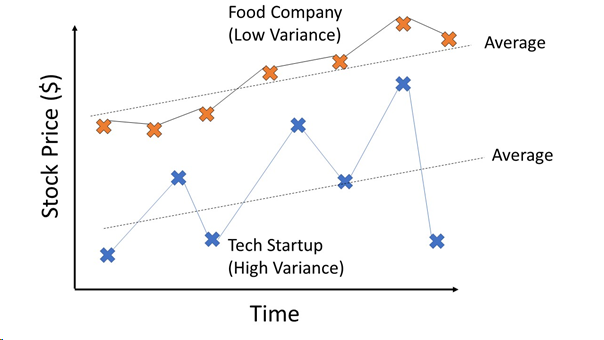
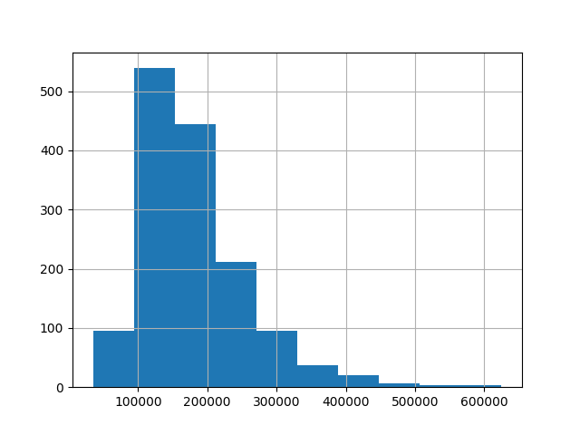
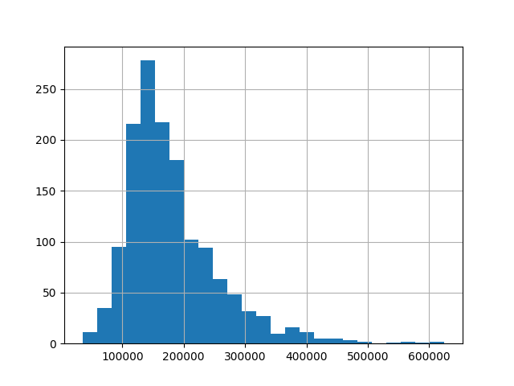
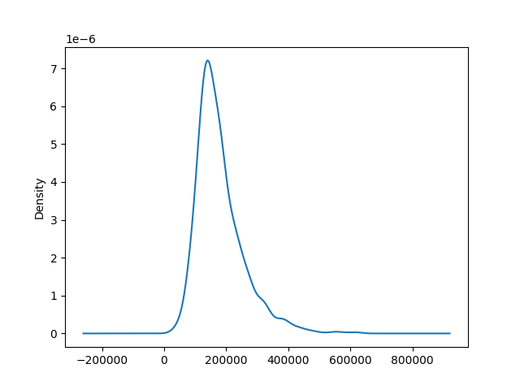

# Základní statistické ukazatele

Máme-li k dispozici nějaký soubor dat, často nás zajímají různé statistické ukazatele. Nejčastěji nás zajímají ukazatele **úrovně (polohy)** a ukazatele **variability**. Ty s přehledem zvládne například modul `statistics`, který je součástí základních modulů Pythonu. My pro zpracování dat využijeme modul `pandas`.

Budeme využívat data o cenách domů, která jsou v souboru `house_prices.csv`. V souboru je důležitý sloupec `SalePrice`, tj. cena domu, a poté různé parametry domu, jako obytná plocha, typ čtvrti, ve které se dům nachází atd. Data načteme ze souboru `clean_train.csv` pomocí metody `read_csv()`. Data jsou uložena do struktury, kterou nazýváme `DataFrame` a je to v podstatě obdoba SQL tabulky.

```py
import pandas
data = pandas.read_csv("clean_train.csv")
```

## Průměr a medián

Nejznámější ukazatele polohy jsou **aritmetický průměr** a **medián**. Aritmetický průměr je součet hodnot vydělený jejich počtem, medián získáme jako prostřední hodnotu u dat seřazených podle velikosti. Platí, že medián je méně citlivý na tzv. **odlehlá pozorování (outliers)**, v našem případě by to byly extrémně drahé nebo naopak levné domy.

Průměr zjistíme pomocí metody `mean()` a medián pomocí metody `median()`.

```py
print(data["SalePrice"].mean())
print(data["SalePrice"].median())
```

V jakých případech nás může průměr zmáast?

- V novinových titulcích se často uvádí průměrná mzda. Dvě třetiny obyvatel ale mají plat nižší než průměrná mzda. O životní úrovni v ekonomice více vypovídá medián mezd.
- Ve středověku byla průměrná délka života asi 30 let, ale byla výrazně ovlivněná úmrtností v raných fázích života. Pokud se člověk dožil 5 let, měl vysokou šanci dožít se 50 let.

## Rozptyl

Ukazatele variability říkají, jak **různorodé** jsou hodnoty v rámci jedné skupiny. Funkci rozptylu si nejlépe ukážeme, když ho spočítáme pro dva různé soubory dat. Uvažujme, že rozdělíme domy do dvou skupin, a to podle typu obytné zóny, ve které se nacházejí. Máme nyní dva nové soubory - `house_prices_RM.csv` s domy v zónách se středně hustou zástavbou a `house_prices_RH.csv` s domy v zónách s velmi hustou zástavbou.

```py
# Načteme data
data_RM = pandas.read_csv("house_prices_RM.csv")
data_RH = pandas.read_csv("house_prices_RH.csv")
# Zjistíme průměry
print(data_RM["SalePrice"].mean())
print(data_RH["SalePrice"].mean())
# Zjistíme rozptyly
print(data_RH["SalePrice"].var())
print(data_RM["SalePrice"].var())
```

Průměr zjistíme pomocí metody `var()`.

Z výsledků vidíme, že průměrná cena domů v obou typech zón je skoro stejná, domy se středně hustou zástavbou však mají výrazně větší rozptyl. To znamená, že ceny domů v zónách se středně hustou zástavbou jsou mnohem více různorodé.

Abychom si popsali význam rozptylu, ukážeme si ho na několika dalších příkladech.

- Uvažujme například známky z testu pro dvě třídy. Obě třídy mají průměr velmi blízký trojce. První třída má velmi malý rozptyl a druhá obrovský. Co to znamená? V první třídě měli skoro všichni trojku, ve druhé třídě měla velká skupina žáků jedničku a jiná velká skupina pětku.
- Vysoký rozptyl u cen akcií většinou znamená, že je akcie riziková. Její cena se totiž v čase hodně mění a může se stát, že prudce klesne ve chvíli, kdy ji budeme potřebovat prodat.



## Varianční rozpětí

Podobnou informaci jako rozptyl nám řekne třeba i **rozdíl nejvyšší a nejnižší hodnoty**, který nazýváme varianční rozpětí. Výhodou variančního rozpětí, kterou dnes už moc neoceníme, je jednoduchost výpočtu, který lze u menších souborů provést z hlavy.

K určení variančního rozpětí potřebujeme zjistit maximum a minimum, k tomu vyžijeme metody `max()` a `min()`.

```py
print(data_RM["SalePrice"].max() - data_RM["SalePrice"].min())
print(data_RH["SalePrice"].max() - data_RH["SalePrice"].min())
```

## Kvantil

Medián odpovídá na otázku, jaká hodnota leží v seřazeném souboru přesně uprostřed, tj. pro jaké číslo platí, že 50 % souboru má menší hodnotu a 50 % větší. Podobnou otázku ale můžeme položit i pro jiné procento, např. se můžeme zeptat, jaká je hraniční hodnota pro 1 %, 10 % nebo 90 % hodnot. Taková čísla označujeme jako **kvantily**. Například desetiprocentní kvantil říká, pro jaké číslo platí že 10 % hodnot souboru je menší a zbylých 90 % větší.

```py
print(data["SalePrice"].quantile(0.1))
```

Jaké otázky můžeme zodpovědět:
- V jakém rozmezí se pohybuje příjem 10 % nejchudších nebo 10 % nejbohatších lidí?
- Jak rychle musím uběhnout maraton, abych patřil mezi 10 % nejlepších závodníků?
- Pokud přijímáme na školu 60 % nejlepších studentů v příjmacím řízení, od jakého počtu bodů budeme přijímat.

Kvantily můžeme využít i jako ukazatel variability - můžeme například vypočítat rozdíl mezi 90%ním a 10%ním kvantilem.

```py
print(data["SalePrice"].quantile(0.9) - data["SalePrice"].quantile(0.1))
```

## Inverzní kvantilová funkce

Zajímavá může být i **opačná otázka** - kolik procent hodnot je menších než nějaká vybraná hodnota? Protože řešíme opačný problém než u kvantilové funkce, někdy se pro tuto funkci používá pojem inverzní kvantilová funkce, častější označení je pak (empirická) **distribuční funkce**.

Pokud bychom například chtěli prodávat dům, mohlo by být zajímavé vědět, kolik procent domů na trhu je levnější než ten náš. K vyřešení této otázky použijeme funkci `percentileofscore` z modulu `scipy`. Funkce má jako první parametr data, se kterými chceme pracovat, a jako druhý parametr hodnotu, pro kterou chceme výpočet provést.

Níže například zjistíme, kolik procent domů je levnějších než 200000.

```py
from scipy import stats
stats.percentileofscore(data["SalePrice"], 200000)
```

Jaké otázky můžeme zodpovědět:
- Kolik procent lidí má menší (a větší) plat než já?
- Pokud chci vyrábět trička, kolik procent jednotlivých velikostí bych měl vyrábět?

## Histogram

Další možností, jak se podívat na rozložení dat, je histogram. Histogram je graf, který pro různé intervaly hodnot zobrazuje, kolik dat se v daném intervalu nachází.



Histogram vytvoříme pomocí metody `hist()`.

```py
data["SalePrice"].hist()
plt.show()
```

U histogramu si můžeme zvolit, na kolik parametrů chceme data rozdělit. Pokud dáváme přednost jemnějšímu dělení, můžeme pomocí parametru `bins` nastavit vyšší počet intervalů, například 25.

```py
data["SalePrice"].hist(bins=25)
plt.show()
```



V histogramech vidíme další důležitou věc - data jsou rozdělena nesymetricky. Z histogramu vidíme, že v datech jsou i nějaká odlehlá pozorování, což je třeba dům s cenou nad 600 tis.

# Distribuční funkce a rozdělení

Uvažujme nyní, že bychom namísto sloupců použili čárový graf. Na osu *y* grafu pak nedáme absolutní počet hodnot v daném intervalu, ale relativní počet hodnot. Takový graf označujeme jako graf **funkce hustoty**. Pokud bychom nyní chtěli vědět, jaká část dat se nachází v nějakém intervalu, zjistili bychom to podle **plochy** pod křivkou.

K vytvoření grafu použijeme metodu `.plot.kde()`. Zkrakta KDE označuje *kernel density estimation*, tj. jádrový odhad hustoty. Musíme totiž myslet na to, že nemáme kompletní data, ale pouze jejich část, proto je naše funkce pouze odhadem funkce hustoty kompletních dat.



```py
data["SalePrice"].plot.kde()
plt.show()
```

Pokud máme funkci hustoty, je to nejlepší možný popis jakýchkoli dat. Postupem času bylo zjištěno, že hustoty mnohých dat mají podobný tvar. Například níže máme čtyři funkce, které jsou sice různé (mají různě vysoké maximum a jsou různé "roztažené"), ale tvar mají podobný. Všechny čtyři hustoty mají stejné tzv. **statistické rozdělení**. To znamená, že všechny čtyři hustoty lze popsat stejnou matematickou funkcí, která se liší pouze proměnnými (konkrétně průměrem a rozptylem). Statistické rozdělení těchto hustot označujeme jako **normální (Gaussovo) rozdělení**.


Normální rozdělení má spousta "jevů", které se vyskytují v přírodě, například délka, výška nebo hmotnost živé tkáně, krevní tlak lidí atd. Používá se také ve financích na oceňování opcí (např. v Black–Scholesově modelu). Normální rozdělení mají často i chyby měření při experimentech.

Vedle normálního rozdělení existuje spousta dalších. Jedním z nich je například exponenciální rozdělení. Exponenciální rozdělení často má délka intervalu mezi dvěma náhodnými událostmi, například příchozími telefonáty v call centru, nebo čas rozpadu radioaktivní částice.


Rovnoměrné rozdělení má pro každé dva stejně široké intervaly stejnou pravděpodobnost, jeho hustota je konstantní funkce. Pro rovnoměrné rozdělení uvažujeme krajní hodnoty *a* a *b*, mimo tyto krajní hodnoty je pravděpodobnost 0.


Rovnoměrné rozdělení existuje ve verzi pro celá i desetinná čísla, pro celá čísla bychom neměli graf hustoty čárový graf, ale graf by se skládal z "teček". Rovnoměrné rozdělení mají (resp. by měly mít) jevy, které souvisí s hazardními hrami. U hracích kostek či rulety by měla být pravděpodobnost padnutí každého z čísel stejná.


# Korelace
